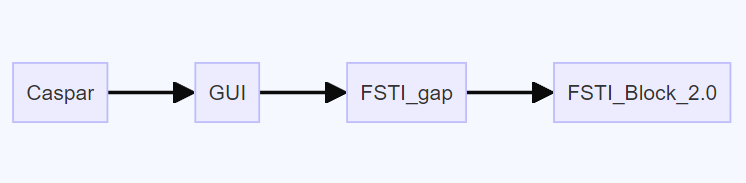
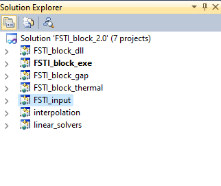
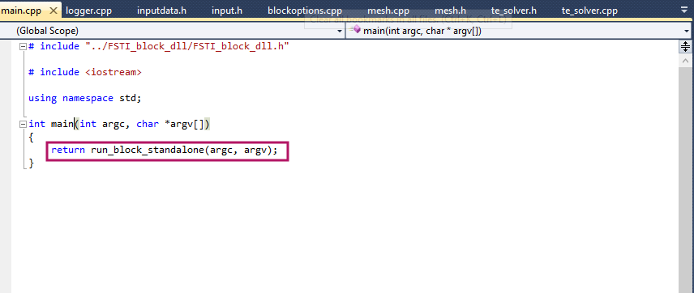

# FSTI_BLOCK

- Here before entering to understand the `FSTI_Block_2.0` module, it is required to know that how flow should understood. For that i is requiered how the solver works 

Steps:

Step 1:  Entering the module `FSTI_Block_2.0`, it has submodule  called `Fsti_block_exe`. It has a source file called `main.cpp` directs to operation of the module. 

        

- Here, `run_block_standalone(argc,argv)` function initiates the simulation. This function calls the functionality `RUN` from submodule called `FSTI_block_dll` with file-name called `main.cpp`.
- 
