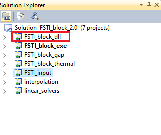
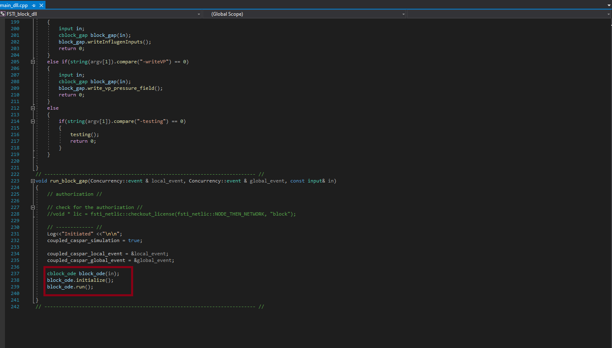

# FSTI_BLOCK

Before delving into understanding the `FSTI_Block_2.0` module, it's essential to comprehend how the flow operates within the solver.

## Steps:

### Step 1:

Upon entering the module `FSTI_Block_2.0`, there's a submodule called `Fsti_block_exe`. The primary operation of this module is directed by the source file `main.cpp`.

The `run_block_standalone(argc, argv)` function initiates the simulation.

### Step 2:

The `run_block_standalone(argc, argv)` function invokes the functionality `RUN` from the submodule `FSTI_block_dll`, with the file named `main.cpp`.

Within this submodule, there's a function `run_block_gap()`, which initializes environmental conditions using `initialize()` and executes `run()`.

### Step 3:

The solver begins by entering the submodule `FSTI_block_gap` and calling `run()`, which is initialized using the file `block_ode.cpp`.

.png)

### Step 4:

Now, as the code initiates the solver, it's time to understand the flow of the code with functions called under different files.

### Function Tracking:

- `cblock_ode::run()`

#### Heat Flux Calculation:

    block_gap.te_VP->solve_htr();  

###Function Tracking: 
    cblock_ode::run()
####Heatflux calculation

    block_gap.te_VP->solve_htr();  
            
#### EHD Calculation ###
    if(EHD)
    {
        Log << gaplog::endl << gaplog::endl;
        block_gap.reynolds.solve_EHD();

        // update the field which stores the EHD solution
        block_gap.gap_main.fields.p_EHD = block_gap.gap_main.fields.p;
    }
    else
    {
        Log << "\nSolving the Reynolds equation ... ";
        block_gap.reynolds.solve_rigid();
        Log << "done!" << gaplog::endl;
    }

#### Energy Calculation

    block_gap.energy.solve();