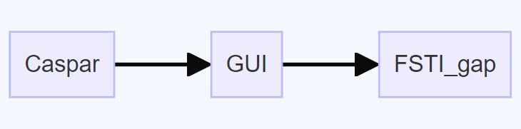
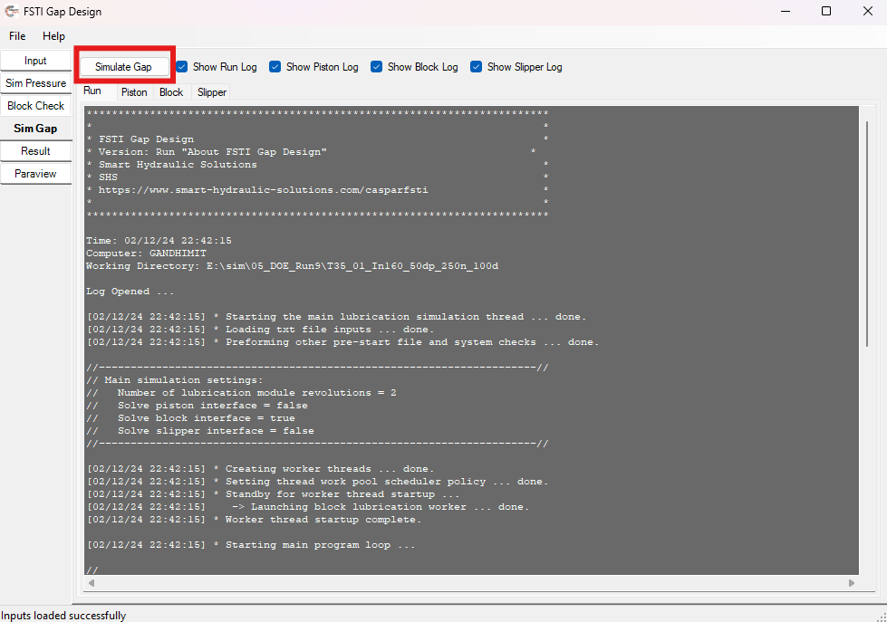
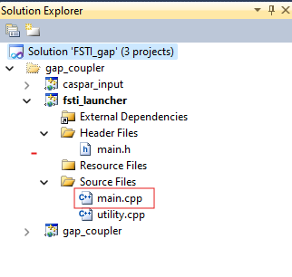
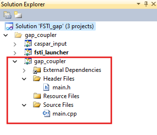
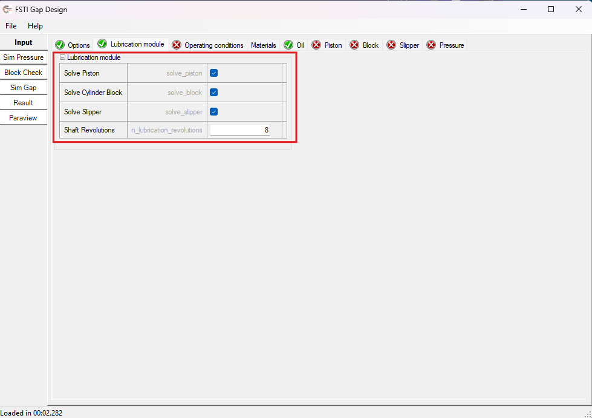
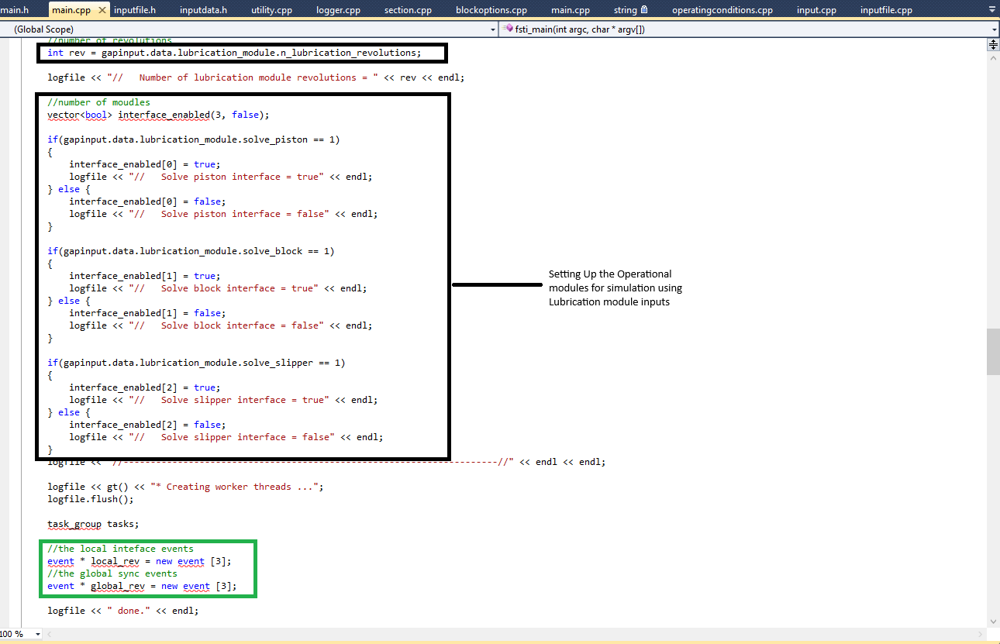
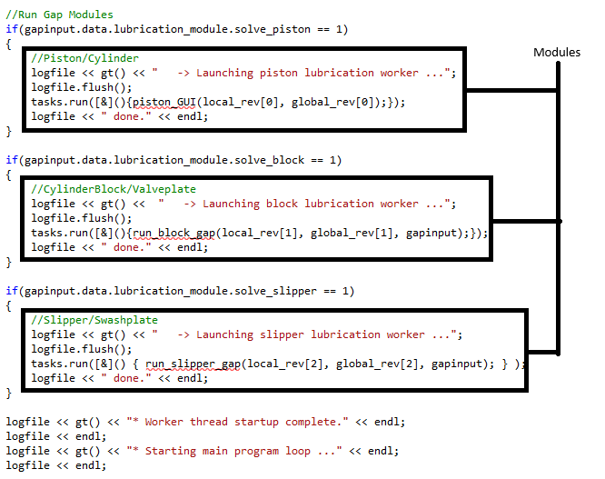

# Caspar

## Workflow

### How Does the Software Work?

- When we run the GUI, we provide an input. If the simulation with the sim_gap functionality is chosen, this document illustrates how the source code initiates.

#### Steps:

1. Entering the simulation, understanding the source code is the right choice. Here, the button on the GUI invokes the `Fsti_gap` module. As shown in [Image 3](#Image-3) below, it starts from the source file `main.cpp` in `fsti_launcher`.

   

2. Furthermore, initializing function in `fsti_launcher` calls the `fsti_main()` function, which is available in the `gap_coupler` source file called `main.cpp`, to initiate the simulation.

   

3. Further, on the basis of the inputs in the lubrication module as shown in [Image 5](#Image-5) below for `lubrication module`, the decision is made for simulation of the specific module from the available options (solve piston, solve Cylinder-Block, solve Slipper) as well as the operating condition such as the number of revolutions is adjusted for the initialization of the simulation.

   

4. Using the defined inputs of the above image section, here code implementation and meaning are shown in [Image 6](#Image-6) below.

   

    ##### Explanation of the above code:
      - In [Image 6](#Image-6), the smaller black box assigns the number of revolutions for the simulation, and the larger black box enables the modules for the simulation.
      - Furthermore, variable tags under the green box in [Image 6](#Image-6) reveal `event* local_rev` and `event* global _rev`, representing the variables for keeping track for the simulator to obtain the convergence based on and off the revolution.

5. Initialization of the simulate_gap is shown in the code below.

   

6. Until the end of the number of the revolution, the process continues and at the end flushes the data after storing the data into Temp. But after the last revolution, the functionality flushes everything.
   (Note: It is not possible to add an image for the explanation as it has much more content and is visually hard to understand.)
