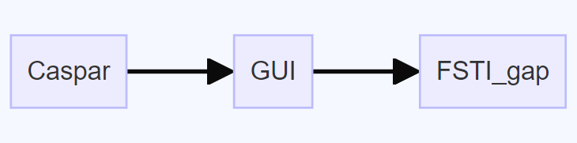
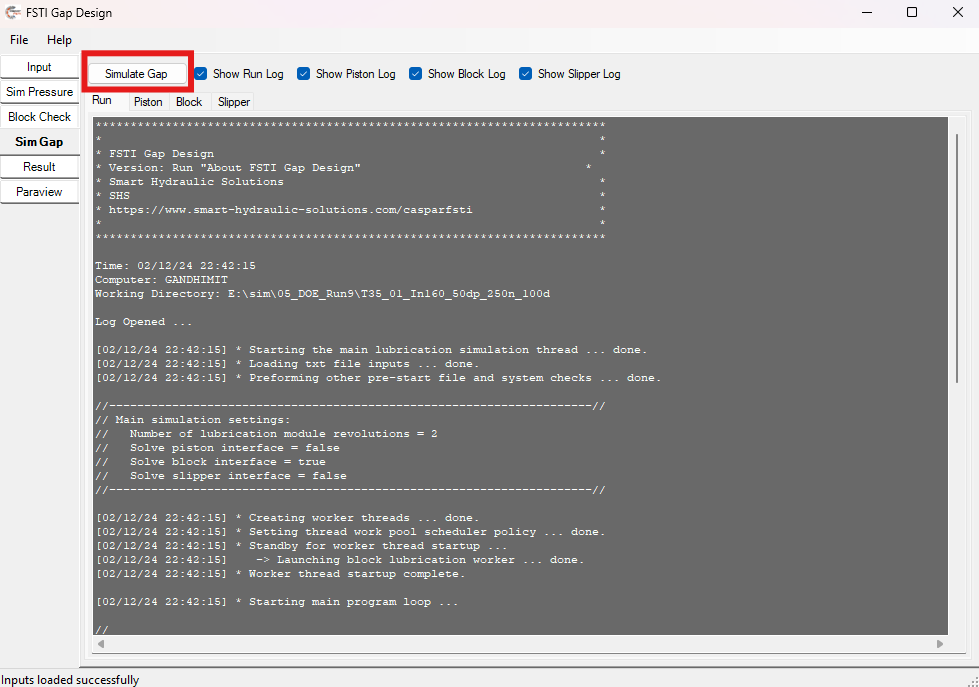
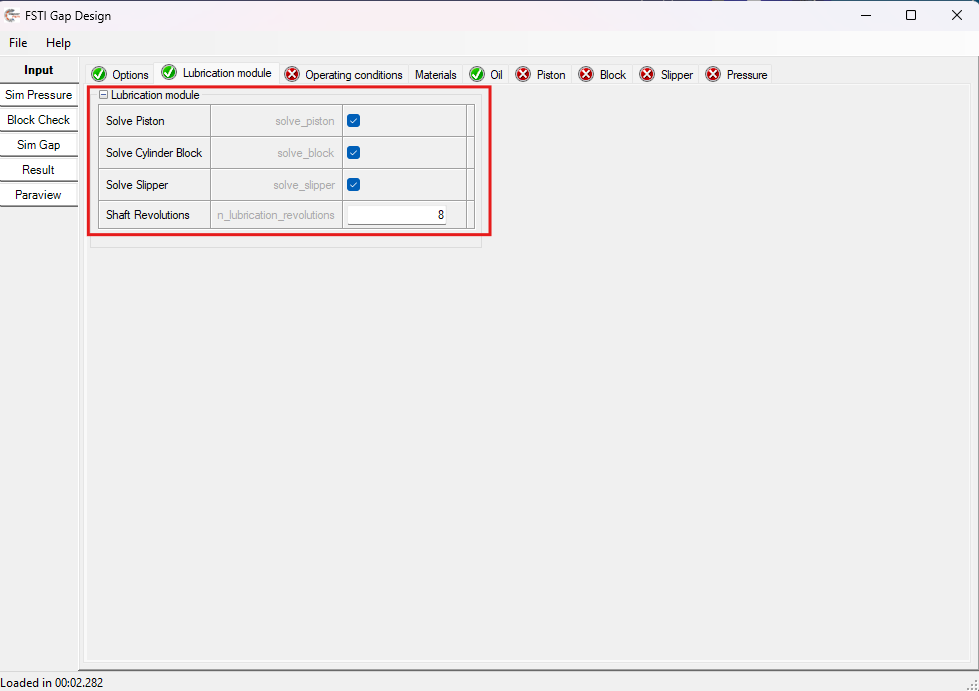

# Caspar

## Workflow

### How Does the Software Work?

- When we run the GUI, we provide an input. If the simulation with the sim_gap functionality is chosen, this document illustrates how the source code initiates.

#### Steps:

1) Entering the simulation, understanding the source code is the right choice. Here, the button on the GUI invokes the Fsti_gap module. As shown in the image below, it starts from the source file `main.cpp` in `fsti_launcher`.

   

2) Furthermore, the function calls the `fsti_main()` function, which is available in the `gap_coupler` source file called `main.cpp`, to initiate the simulation.

   

3) Further, on the based of the inputs in lubrication module as shown below image for `lubrication module` , the decision is made for simulation of the specific module from the available options (solve piston, solve Cylinder-Block, solve Slipper) as well as the operating condition such as number of the revolution is adjustec for the initialization of the simulation.
   
   
   

   - Using the defined the inputs of the above the image section the code implements as show below. 
      
   - In the above image, smaller black box assigns no. of revolution for the simulation and the larger black box enables the modules for the simulation. 
   - Further more `event* local_rev` and `event* global _rev` represents the the variables for keeping a track for the simulator to obtain the convergence based on and of the revolution.
   - 